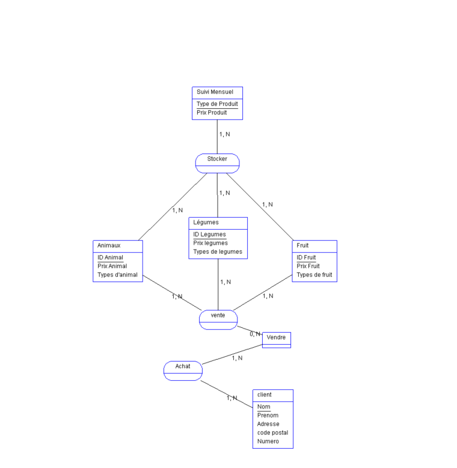

## 1. Introduction à la Modélisation de Données

### La modélisation de données
La modélisation de données est le processus de création d'un modèle pour organiser et structurer les données, de manière à refléter les relations et les contraintes entre les différentes entités d'un système. Cela permet de comprendre et de documenter les besoins en données d'une organisation, facilitant ainsi la conception et la mise en œuvre de bases de données.

### Merise : Une Méthode de Conception de Systèmes d'Information
Merise est une méthode de conception de systèmes d'information qui se concentre sur la modélisation des données et des traitements. Elle est largement utilisée en France et se compose de plusieurs étapes et modèles, notamment :
- **Modèle Conceptuel des Données (MCD)** : Représente les entités et les relations entre elles sans se soucier des aspects techniques.
- **Modèle Logique des Données (MLD)** : Traduit le MCD en un modèle plus proche de la structure de la base de données, en tenant compte des contraintes d'intégrité.
- **Modèle Physique des Données (MPD)** : Détaille la manière dont les données seront physiquement stockées dans la base de données.

Merise inclut également des modèles pour les traitements et les flux d'information, permettant une approche complète de la conception des systèmes d'information.

---

## 2. Le Recueil d'Informations

### Méthodes de Recueil d'Informations
Le recueil d'informations est une étape cruciale pour comprendre les besoins de l'organisation. Les méthodes incluent :
- **Interview/Enquête**
- **Étude des documents internes**
- **Étude des documents externes**

### Types d'Informations

#### Informations Élémentaires
Une information élémentaire doit être atomique, c'est-à-dire non décomposable. Par exemple :
- **34 rue de la paix** => Adresse
- **75000** => Code Postal
- **Paris** => Ville

Une valeur prise par une information élémentaire est une **occurrence**.

---

## 3. L'Approche Nivelée

Pour effectuer la conception d'un système d'information (SI), on utilise une approche nivelée composée de quatre niveaux :

### 3.1. Le Niveau Conceptuel
Le niveau conceptuel permet de modéliser les données de l'entreprise. On utilise le **Modèle Conceptuel de Données (MCD)** pour modéliser les données, et le **Modèle Conceptuel des Traitements (MCT)** pour modéliser les traitements effectués sur ces données.

### 3.2. Le Niveau Organisationnel
Le niveau organisationnel intègre des notions de temporalité, de chronologie des opérations, de contraintes géographiques, et de niveaux d'accès. On utilise le **Modèle Organisationnel des Traitements (MOT)** pour représenter ces aspects.

### 3.3. Le Niveau Logique
Ce niveau permet de structurer les données en tenant compte des dépendances fonctionnelles et des règles d'intégrité.

### 3.4. Le Niveau Physique
Le niveau physique détaille la manière dont les données seront physiquement stockées dans la base de données.

---

## 4. Les Dépendances Fonctionnelles

### Classification des Données par Type
Pour être intégrées dans un système d'information, les données doivent être triées et organisées. Les types de données courants sont :
- **Chaînes de caractères** : format texte
- **Type alphanumérique** : format texte
- **Type numérique** : (integer, float, etc.)
- **Type date** : (date, datetime, timestamp)
- **Type logique ou booléen** : (true, false)

### Création d'un Dictionnaire de Données
Suite à l'interview et la collecte des documents, il est nécessaire de centraliser toutes les informations et règles de gestion dans un document appelé **dictionnaire des données**.

#### Exemples de Dépendances Fonctionnelles

**Dépendances Fonctionnelles pour les Clients** :
- Numcli → Nom
- Numcli → Prénom
- Numcli → Adresse
- Numcli → Code Postal
- Numcli → Ville

**Dépendances Fonctionnelles pour les Articles** :
- CodeArticle → Désignation
- CodeArticle → PrixUnitaire

Les dépendances fonctionnelles peuvent être exprimées de manière condensée, par exemple :
- Numcli → (Nom, Prénom, Adresse, Code Postal, Ville)
- CodeArticle → (Désignation, PrixUnitaire) ..

### Passage du MCD au MLD :
 
Pour passer du MCD au MLD, il suffit de supprimer les relations entre les entités. Elle comprend cependant certaines règles :
 
#### Cas simple : (0,n) (1,1) ou (1,n) (0,1) :
 
- **(0,n)** et **(1,n)** : sont considérées comme des cardinalités / identitées **"fortes"**.
 
- **(0,1)** et **(1,1)** : sont considérées comme des cardinalités / identitées **"faibles"**.
 
 
 
À NOTER :
 
    À chaque fois qu'on passe du MCD au MLD, c'est l'entité qui possède la cardinalité / identité la plus forte qui recevra le(s) identifiant(s) de l'autre entité qui possède la cardinalité la plus faible.
 
    L'entité qui possède la cardinalité maximale égale à 1 recevra l'identifiant ou les identifiants des entités ayant les cardinalités maximales les plus fortes.
 
    Les relations ayant toutes leurs entités reliées avec des cardinalités maximales supérieures à 1 se transformeront en entité en absorbant les identifiants des entités jointes.
 
    Toute relation porteuse de propriétés se transformera en entité et absorbera comme clé étrangère les identifiants des entités qui lui sont liées.
 
    Toute relation réflexive se transformera en entité et absorbera comme clé étrangère l’identifiant de l’entité qui lui est liée.

#### Exercice 1

    MCD 

    MLD
